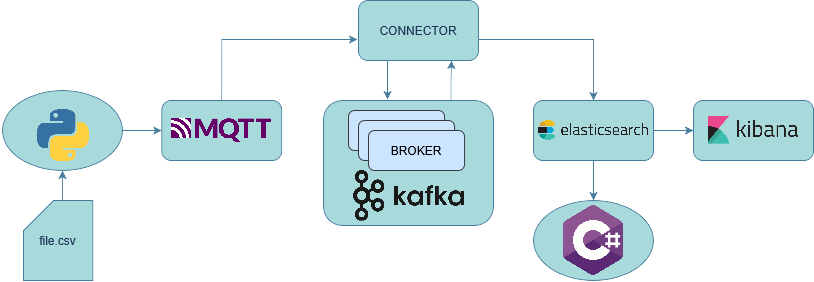

# TBDM
Repository for the "Technologies for Big Data Management" course, held by professor Massimo Callisto De Donato - University of Camerino, Italy.

# Participants

- Damiano Buzzo - damiano.buzzo@studenti.unicam.it
- Francesco Pizzuto - francesco.pizzuto@studenti.unicam.it
- Eduardo Tiano - eduardovincenz.tiano@studenti.unicam.it

# Scope of the project

The project focuses on the analysis of data generated by sensors connected to a dewatering machine, considered a CPS (Cyber Physical System), utilising Elasticsearch, Kibana, and Kafka; they're, as the name of the course suggests, _technologies for Big Data management_.

The project involves many features. First of all, a streaming pipeline has been created, using MQTT to simulate the real-time streaming of data into Kafka. Then, Kafka has been connected to Elasticsearch, which uses Kibana for visualisation. Inside Kibana, some dashboards with relevant data have been produced and are available for interaction. A map visualisation has been provided too. The project also integrates a .NET connector, for communication with a custom endpoint written in C#. The project also investigated the integrated ML model, useful to obtain insights about historical data. Finally, a real-time watcher has been configured to log critical parameters for real-time data.

# Description and prerequisites

The project has been developed using Docker, a development tool that permits a fast, platform-independent deployment, running applications in containers. Each container represents and independent unit that is isolated from the others, but collaborates to realise the application's behaviour. The user needs to install [Docker](https://www.docker.com/products/docker-desktop/), and have a stable [Python version](https://www.python.org/downloads/) before proceeding in the guide.
It is also necessary to execute some REST APIs. [Postman tool](https://www.postman.com/downloads/) is recommended.

Optionally, the user can install [MQTT Explorer](http://mqtt-explorer.com/) to visualise MQTT messages.

It's highly recommended to allocate at least 16 gigabytes of RAM memory for Docker, to avoid performance issues, and a reasonably high number of processors (not all the available ones on the host machine). Edits can be performed modifying the [wsl.config](https://learn.microsoft.com/en-gb/windows/wsl/wsl-config) file.

# Structure of the project


# Installation

To run the project, the user must clone this repository in a directory using the Git command:
```
git clone https://github.com/edunando15/TBDM.git
```
and then open Docker. Then, the user shall type in the same directory in which the repository has been cloned:
```
docker-compose up -d
```
to startup the initialisation process, which will be automatically performed by Docker, installing all the necessary files.

# Configuration

Once the process has ended and all containers are running, the user shall import the file called "TBDM.postman_collection.json" into Postman, and execute the "MQTT Connector Configuration" and "Elasticsearch Connector Configuration" APIs. This creates 2 connectors: one between MQTT and Kafka, and another between Kafka and Elasticsearch. To check that both run seamlessly, the user can execute the "Get Active Connectors" API. The two connectors should be shown.

# Ready-to-use guide

Users reaching this point are able to stream any data in JSON format to an MQTT topic called "new-test-topic". Data will be received by Elasticsearch.

To inject the machine data into Elasticsearch, the user can either open the Elasticsearch UI, clicking on the port section of the container named "kibana" in Docker, and then, in the discover section, upload the CSV file manually (the file is located in MQTTStreamer/Resources/dati_macchina_copy.csv); or execute the FullUploader.py file in the MQTTStreamer directory. To execute the script, it can either be opened in and IDE and executed, or the user can:
- open the terminal;
- type ```cd path/to/MQTTStreamer```
- type ```python FullUploader.py```

At this point, data should be visible both in Kibana (Discover section) and Kafka, and MQTT Explorer as well. 

# Map visualisation

To visualise data in a map, the user first needs to create a data view. To do that, the user can go to Stack Management -> Data view and create a new Data view, based on a certain index. Then, the user needs to copy data from the index to another one, in which coordinates are in a proper format (Geospatial field). It is assumed that, in the first index, there are two fields called "latitude" and "longitude", at least like it's shown in the "dati_macchina_copy.csv" file in the MQTTStreamer directory. To do this, the user can go to Dev Tools, and execute the following request:

```PUT /your-new-index-name
{
  "mappings": {
    "properties": {
      "location": {
        "type": "geo_point"
      },
      "latitude": {
        "type": "float"
      },
      "longitude": {
        "type": "float"
      }
    }
  }
}
```

In this way, a new index where documents contain a Geospatial field is created. Then, in the same page, the user needs to execute the following request:

```POST _reindex
{
  "source": {
    "index": "your-source-index"
  },
  "dest": {
    "index": "your-new-index-name"
  },
  "script": {
    "source": "ctx._source.location = ['lat': ctx._source.latitude, 'lon': ctx._source.longitude]"
  }
}
```

In this manner, data will be copied in a new index containing a Geospatial field.

To visualise the data, the user has to open the "Map" page (under the Analytics section), select the "Add Layer" option, select the previously created data view and the newly created Geospatial field. Don't forget to select the correct time range!

# Alerts enablement

To generate alerts it's necessary to generate encryption keys in Kibana. To do that, the user shall:

- open the terminal in the directory in which Docker is running;
- type ```docker exec -it kibana /bin/bash``` to open the Kibana CLI;
- type ```kibana-encryption-keys generate``` to generate the encryption keys.

Once they've been generated, the user shall copy each key and paste it in the corresponding field in the file named kibana.yml, save the file and restart Docker by tipying
```docker restart```

# Export/import of dashboards and indexes(saved objects)

In Kibana it is possible to export/import dashboards and indeces (saved objects) to share configurations between different istances of the software. To do that the user can go to Stack Management -> Saved Objects.

In this section it's possible to export saved objects in ndjson format. In this repository in [exports](/exports) you can find some example configurations that represent the dashboard we have done exploring the dewatering machine data.

To import the saved objects the user can import the ndjson files in the same section previously mentioned.
# ML model

Elasticsearch offers a Machine Learning model that can be used to analyze data. The user can access it in the Machine Learning page under the Analytics section. To start a new analysis, the user must select "Create Job" -> choose the index -> configure the options according to the needs.

At this point, the user shall be able to create dashboards, alerts, watchers, and visualise by choice.

# C# connector
The project integrates a C# connector to interact with Elasticsearch, enabling efficient data retrieval for analysis and visualization. The connector is implemented using the NEST client, a high-level [.NET library](https://www.elastic.co/guide/en/elasticsearch/client/net-api/current/getting-started-net.html) for Elasticsearch. This allows users to perform queries, retrieve sensor data, and process results within a C# environment. To use the connector, the user must ensure the .NET SDK is installed and configure the connection settings to match the running Elasticsearch instance. The provided C# client simplifies data retrieval, making it easy to integrate Elasticsearch data into .NET applications.


